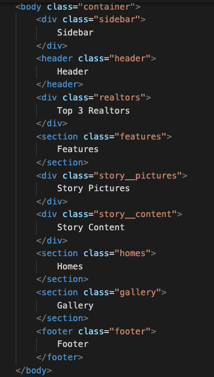
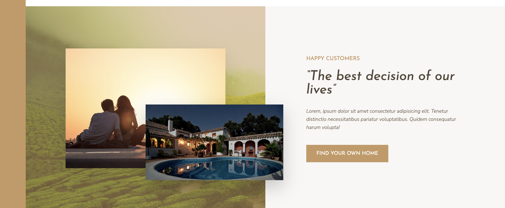

# Nexter - Practice CSS Grid 

This project is the property of Jonas Schmedtmann. This is a practice project to learn and improve using CSS Grid. 

The full course can be located on Udemy, called: "The most advanced and modern CSS course on the internet: master flexbox, CSS Grid, responsive design, and so much more."

## Project Overview

The design and layout is a fictional realestate websiite that displays homes for sale. 

The aim of this project is to practice CSS Grid 

**Requirements**

- Firefox - This is to practice using the Developer Tools in Firefox 

## Getting Started 

``npm install``

``npm run start``

This will open in the browser: Firefox - To practice using the developer tools.

Note: to make sure this is working, make a small change in the HTML / CSS files to see this is reflects in the css/style.css file. 

## Learnings

Set up of all the components (as per the design).

There are 8 main components to the layout. 

___

## Screenshot Progress

**Created the Grid Layout**

**Features Section**

* icons
* typography 
* features and feature sass file updated

**Story and Pictures**

* can use grid or flexbox - end decision use grid to achieve the same result
* grid container for the images

**Home Section**

* styling image 
* content displays
* display icons
* contact realtor button 

**Gallery Section**

This was complicated. Using the developer tools in firefox helped visualise the grid layout.

* grid-gap added with padding to make it look like it has a gutter

**Footer Section**

**Sidebar Section**

* This is only the button - does not include functionality 

**Header Section**

* background image 
* button
* display logos

